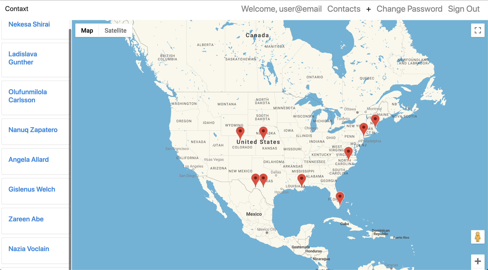

# Contaxt

A map-based address book

- [Hosted Site](https://kdoxsey.github.io/contaxt/)
- [Client Repo](https://github.com/kdoxsey/contaxt)
- [API Repo](https://github.com/kdoxsey/api-contaxt)
- [Heroku Url](https://still-everglades-32605.herokuapp.com/)
- [react-google-maps Documentation](https://tomchentw.github.io/react-google-maps/#documentation)

## User Stories

- As an unregistered user I want to sign up.

- As a registered user I want to sign in.

- As a registered user I want to change my password.

- As a registered user I want to sign out.

- As a signed in user I want to create a contact.

- As a signed in user I want to update/delete contacts.

- As a signed in user I want to view only my contacts.

- As a signed in user I want to view many or one of my contacts.

- As a signed in user I want to view my contacts in an index AND on the map.

## Technologies Used

### Client-Side

- React
- HTML/CSS/JavaScript
- Bootstrap
- Semantic-UI
- react-google-maps

### Server-Side

- Heroku
- Node.js
- MongoDB
- Mongoose
- Express

## Future Development

- First priority is implement GeoCoding so that users can search for an address without geo coordinates.

- Allow user to create different maps where they can assign different contacts to different maps.

- Alphabetize the contact index on the left.

- Make ContactShow a modal.

## ERD & Wireframes

[ERD]
(https://imgur.com/N1HYlRy)

[WIREFRAMES]

- [Create](https://imgur.com/uelJEHc)
- [Home](https://imgur.com/ruvMvlk)
- [Index](https://imgur.com/cA4hn97)
